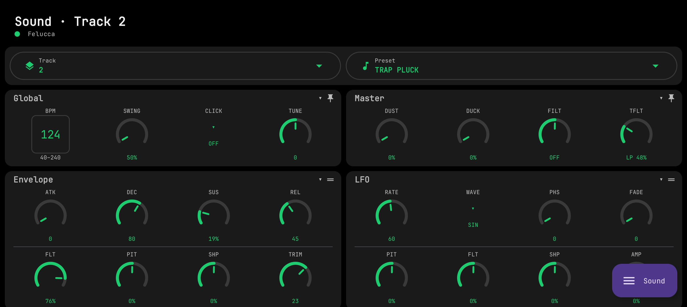
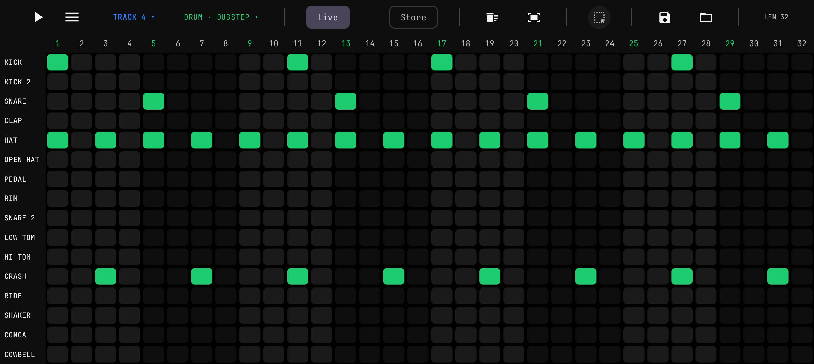
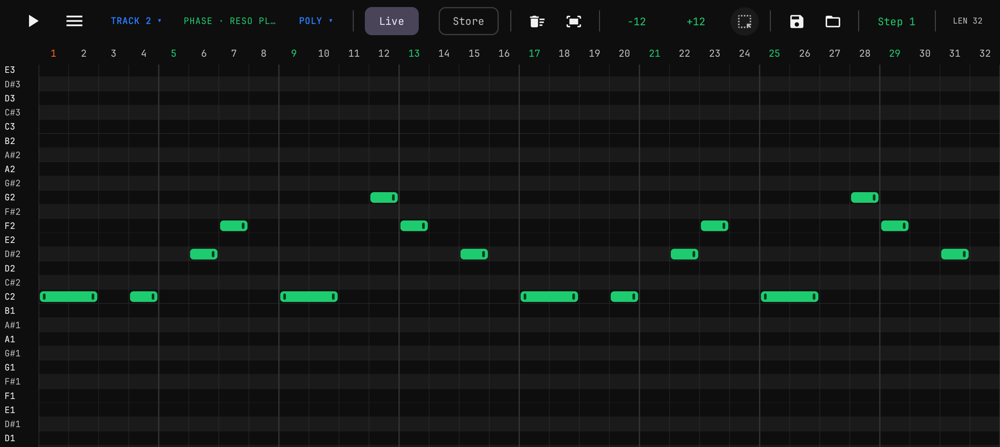
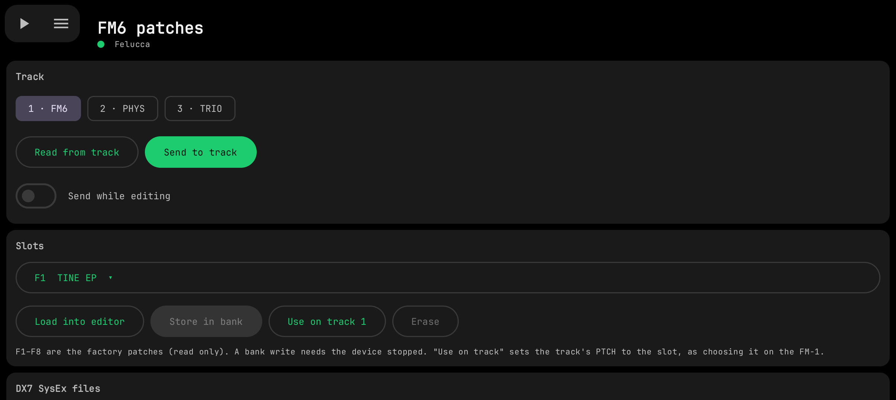
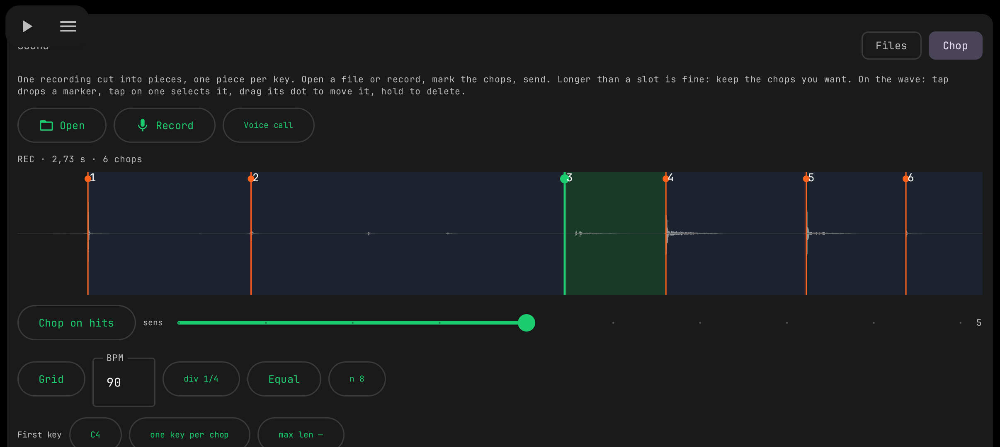
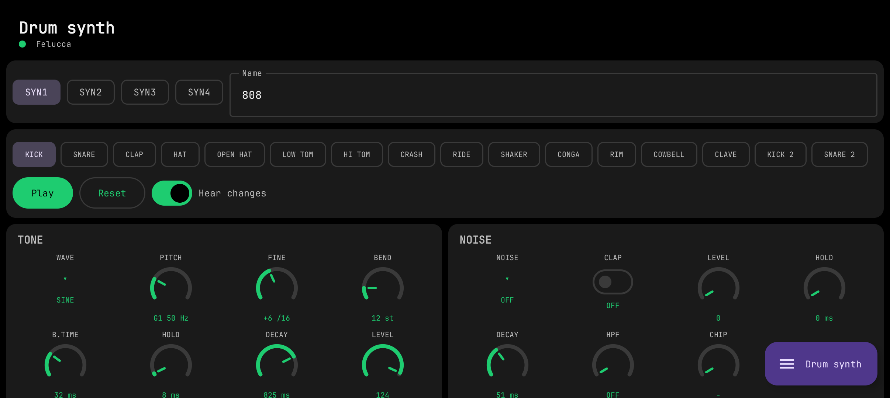

# Sloop Go

A native Android app (Kotlin + Jetpack Compose) for the **M-VAVE FM-1** running the **SLOOP** firmware.
It talks to the device directly over USB-MIDI through Android's `MidiManager` — no WebView, no JavaScript bridge —
so edits reach the FM-1 immediately.

<table>
  <tr>
    <td></td>
    <td></td>
    <td></td>
  </tr>
  <tr>
    <td></td>
    <td></td>
    <td></td>
  </tr>
</table>

> **Made on the basis of the work of others.** Sloop Go is a companion app developed for
> [**SLOOP**](https://github.com/isod89/sloop-fm1) by **isod89**, which in turn builds on
> [**Felucca**](https://github.com/hugelton/Felucca) by **Leo Kuroshita / Hügelton Instruments**.
> The editor protocol, the FM6 patch format and the firmware itself are their work — this app would not
> exist without them. See [NOTICE.md](NOTICE.md).

## Features

- **Sound** — all sound parameters in collapsible blocks with touch knobs, engine / kit and preset pickers, track selector.
- **Sequencer** — drum grid and synth piano-roll with pinch zoom, Live / Store (draft) modes, voice modes, step nudge /
  fill / parameter locks (SLOOP 2.4); piano-roll **Select** mode (frame-select, drag the whole figure, hold to clone it,
  existing notes win on overlap), ±12 transpose; **Save / Load** of note patterns as MIDI files kept inside the app
  (separate piano-roll and drum lists with previews; tap to load, or hold one and drag it onto the piano roll; 12 ready
  drum and 12 ready piano patterns included). Only the notes are stored, never the sound or knob positions. A **MIDI
  patterns** page renames, deletes and loads them onto any track.
- **FM6 patches** (SLOOP 2.4) — slot library, DX7 SysEx import / export from phone storage, upload to the bank or to a
  track, and a full six-operator editor.
- **Samples** (SLOOP 2.4) — USR1–4 user sample slots. Load audio files from phone storage **or record straight from
  the mic** (voice / camera / raw inputs selectable) and drop the take into the slot: **Files** mode maps each file to
  its note (root from the file name, the rest of the keyboard splits itself), **Chop** mode cuts one take into pieces
  on a touch waveform — markers snap to hits, drag to move, per-chop keep / length, auto-fit to the slot. Everything
  is normalized, resampled to 22050 Hz and encoded to IMA ADPCM in-app, then written to the FM-1 over the editor
  protocol with progress — ready to play via SAMPLE on a track.
- **Mixer** and **Device** pages, Play / Stop over USB-MIDI.

Requires a phone with USB host (OTG) and a USB-C cable to the FM-1. Written for SLOOP 2.4 (editor protocol v9);
features that need newer firmware are hidden or disabled on older SLOOP.

## Build

```bash
./build-android.sh            # debug APK
./build-android.sh release    # release APK (signed with the debug key unless you configure your own)
```

Needs JDK 17+ and the Android SDK (platform 34). Details and architecture: [android/README.md](android/README.md).

## License

Copyright (C) 2026 Sloop Go contributors.

This program is free software: you can redistribute it and/or modify it under the terms of the
**GNU General Public License, version 3** as published by the Free Software Foundation. It is distributed in the hope
that it will be useful, but **WITHOUT ANY WARRANTY**; without even the implied warranty of MERCHANTABILITY or FITNESS
FOR A PARTICULAR PURPOSE. See [LICENSE](LICENSE) for the full text.

Writing to a device can overwrite its data: back up your FM-1 first and use this software at your own risk.
