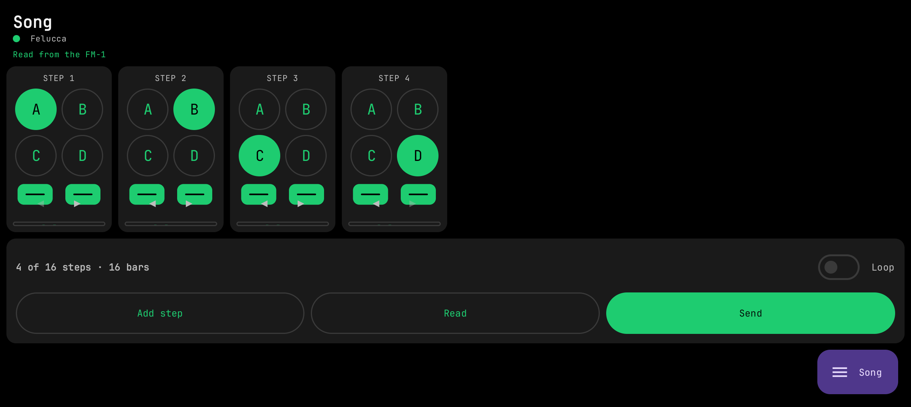
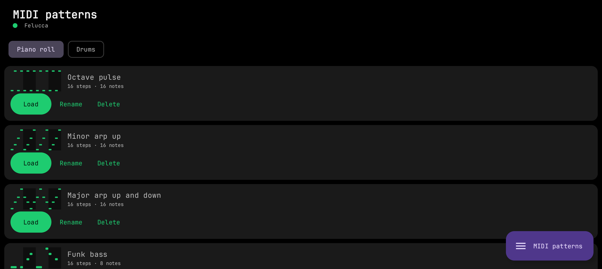
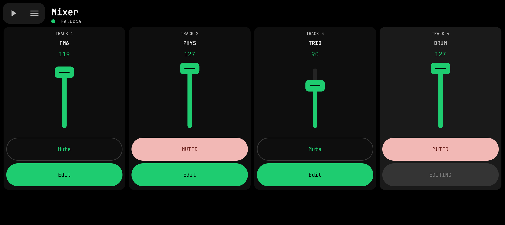

# Sloop Go

A native Android app (Kotlin + Jetpack Compose) for the **M-VAVE FM-1** running the **SLOOP** firmware.
It talks to the device directly over USB-MIDI through Android's `MidiManager` — no WebView, no JavaScript bridge —
so edits reach the FM-1 immediately.

<table>
  <tr>
    <td></td>
    <td></td>
    <td></td>
  </tr>
  <tr>
    <td></td>
    <td></td>
    <td></td>
  </tr>
  <tr>
    <td></td>
    <td></td>
    <td></td>
  </tr>
</table>

## Install on your phone

**⬇ [Download sloop_go_1.7.4.apk](https://github.com/jahlib/sloop-fm1-go/releases/download/1.7.4/sloop_go_1.7.4.apk)**
— other versions live on the [Releases](https://github.com/jahlib/sloop-fm1-go/releases) page.

0. You need an **M-VAVE FM-1** device with the latest [**SLOOP** firmware](https://github.com/isod89/sloop-fm1)
   already installed — the app is only an editor for it and does nothing without the device.
1. Open the link **on the phone** and download the file. The browser may warn that APKs "might be harmful" —
   this is a self-signed dev build, so the warning is expected; keep the file.
2. Tap the downloaded file and allow installing apps from this source when Android asks.
3. **Google Play Protect will flag the app** — it is a development build signed with a debug key, not a Play Store
   release, so the scanner does not know it. Tap **"Install anyway"** (or **More details → Install anyway**) if you
   trust it; if you do not, simply do not install — building the APK from this repository yourself gives you the
   same app.
4. Connect the FM-1 to the phone over USB, open **Sloop Go**, tap **Find MIDI device** and grant USB access.

**Updates:** on launch the app checks the latest GitHub release (tag = version); when it is newer than the installed
build it offers to download the attached APK and starts the system installer. Android asks once to allow installs
from Sloop Go. The **Updates** block at the bottom of the **Device** page runs the check by hand.

> **Made on the basis of the work of others.** Sloop Go is a companion app developed for
> [**SLOOP**](https://github.com/isod89/sloop-fm1) by **isod89**, which in turn builds on
> [**Felucca**](https://github.com/hugelton/Felucca) by **Leo Kuroshita / Hügelton Instruments**.
> The editor protocol, the FM6 patch format and the firmware itself are their work — this app would not
> exist without them. See [NOTICE.md](NOTICE.md).

## Features

- **Sound** — all sound parameters in collapsible blocks with touch knobs, engine / kit and preset pickers, track selector.
- **Sequencer** — drum grid and synth piano-roll with pinch zoom and a single icon toolbar, Live / Store (draft)
  modes, voice modes, step nudge / fill / parameter locks (SLOOP 2.4); **Select** mode in the piano roll and the drum
  grid (frame-select — or just hold empty space in the piano roll, drag the whole figure, stretch them all by one
  note's edge, hold to clone it, existing notes win on overlap), ±12 transpose with auto-fit (only the selected notes
  in Select mode); in the drum grid **hold a lane name** (e.g. KICK) and drag it onto another lane to move all of its
  hits at once (kick → kick 2, open hat → closed hat…); **Save / Load** of note
  patterns as MIDI files kept inside the app (separate piano-roll and drum lists with previews; tap to load, or hold
  one and drag it onto the piano roll; 30 ready drum and 40 ready piano patterns included, many of them 32 or 64 steps —
loading a longer clip grows the pattern length to fit it). Only the notes are stored,
  never the sound or knob positions. A **MIDI patterns** page renames, deletes and loads them onto any track.
- **FM6 patches** (SLOOP 2.4) — slot library, DX7 SysEx import / export from phone storage, upload to the bank or to a
  track, and a full six-operator editor in Sound-style knob blocks: per-operator envelope previews, carriers and
  feedback marking, LFO and pitch-EG blocks, double-tap a knob to restore the init value. **Live / Store** like in the
  sequencer: Live sends every change to the track at once, Store keeps edits on the phone until **SEND**, which sits
  next to the menu button in the pinned top-left cluster so it is always in reach.
- **Drum synth** (SLOOP 2.5) — the four synthesised kits SYN1–SYN4 in Sound-style knob blocks, heard while editing. A pinned top bar holds play/stop, the menu, the SYN picker, the
  kit name and Reset; the 16 sound pads are pinned along the bottom — hold a pad to hear your knob edits —
  the knobs scroll between.
- **Song** (SLOOP 2.5) — vertical step cards: A–D section buttons, Bars / Times steppers, move and delete, loop,
  one-tap Add step, read / send.
- **Samples** (SLOOP 2.4) — USR1–4 user sample slots (a dropdown shows the picked one). Load audio files from phone
  storage **or record straight from the mic** (camera / voice / raw inputs selectable) and drop the take into the
  slot: **Chop** mode (the default) cuts one take into pieces on a touch waveform — the chop keys sit on a pinned
  bottom strip, markers snap to hits, drag to move, per-chop keep / length, auto-fit to the slot; **Files** mode maps
  each file to its note (root from the file name, the rest of the keyboard splits itself). Everything
  is normalized, resampled to 22050 Hz and encoded to IMA ADPCM in-app, then written to the FM-1 over the editor
  protocol with progress — ready to play via SAMPLE on a track.
- **Mixer** — four vertical channel strips with faders, Mute and Edit.
- **Device** — connection and firmware info. Play / Stop and the page menu are pinned in the top-left corner of every
  page and wake up once the FM-1 is connected.
- **Undo / redo** — the first row of the page menu. Every edit (knobs, mixer, steps and notes, per-step nudge / fill /
  locks, FM6 voice, drum synth sounds and kits, song order) is also noted in the phone's RAM; undo sends the earlier
  value through the same request queue as a normal edit. The history is dropped on disconnect, and parts of it when an
  engine / preset swap makes old values meaningless. Flash writes (Store, sample upload / erase) are not undoable.

Requires a phone with USB host (OTG) and a USB-C cable to the FM-1. Written for SLOOP 2.4 (editor protocol v9);
features that need newer firmware are hidden or disabled on older SLOOP.

## Build

```bash
./build-android.sh            # debug APK
./build-android.sh release    # release APK (signed with the debug key unless you configure your own)
```

Needs JDK 17+ and the Android SDK (platform 34). Details and architecture: [android/README.md](android/README.md).

## License

Copyright (C) 2026 Sloop Go contributors.

This program is free software: you can redistribute it and/or modify it under the terms of the
**GNU General Public License, version 3** as published by the Free Software Foundation. It is distributed in the hope
that it will be useful, but **WITHOUT ANY WARRANTY**; without even the implied warranty of MERCHANTABILITY or FITNESS
FOR A PARTICULAR PURPOSE. See [LICENSE](LICENSE) for the full text.

Writing to a device can overwrite its data: back up your FM-1 first and use this software at your own risk.
